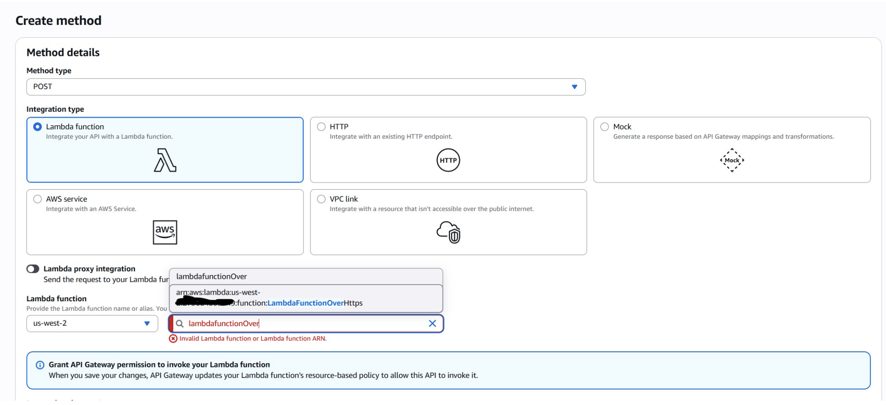
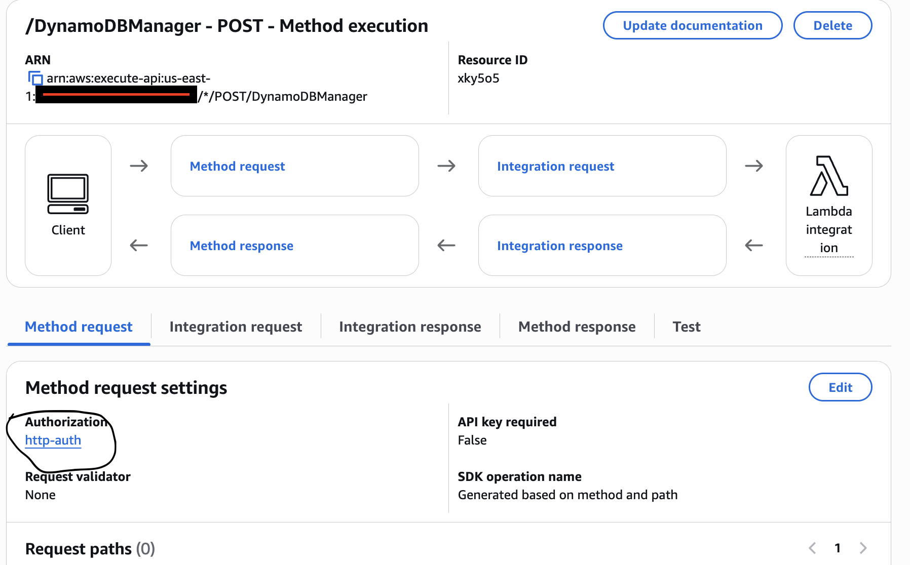

Architecture of Serverless CRUD function is 


An Amazon API Gateway is a collection of resources and methods. In this demo, I created one resource (DynamoDBManager) and define one method (POST) on it. The method is backed by a Lambda function (LambdaFunctionOverHttps). That is, when I call the API through an HTTPS endpoint, Amazon API Gateway invokes the Lambda function.

The POST method on the DynamoDBManager resource supports the following DynamoDB operations:

Create, update, and delete an item.
Read an item.
Scan an item.
Other operations (echo, ping), not related to DynamoDB, that I can use for testing.

The following is a sample request payload for a DynamoDB create item operation:

```json

{
    "operation": "create",
    "tableName": "lambda-apigateway",
    "payload": {
        "Item": {
            "id": "1",
            "name": "Joe"
        }
    }
}
```

The following is a sample request payload for a DynamoDB read item operation:

```json
{
    "operation": "read",
    "tableName": "lambda-apigateway",
    "payload": {
        "Key": {
            "id": "1"
        }
    }
}
```

# **Setup**

# **Create Custom Policy**
We need to create a custom policy for least privilege

1. Open policies page in the IAM console
2. Click "Create policy" on top right corner
3. In the policy editor, click JSON, and paste the following


``` json

{
    "Version": "2012-10-17",
    "Statement": [
    {
      "Sid": "Stmt1428341300017",
      "Action": [
        "dynamodb:DeleteItem",
        "dynamodb:GetItem",
        "dynamodb:PutItem",
        "dynamodb:Query",
        "dynamodb:Scan",
        "dynamodb:UpdateItem"
      ],
      "Effect": "Allow",
      "Resource": "*"
    },
    {
      "Sid": "",
      "Resource": "*",
      "Action": [
        "logs:CreateLogGroup",
        "logs:CreateLogStream",
        "logs:PutLogEvents"
      ],
      "Effect": "Allow"
    }
    ]
    }
```

4. Give name "lambda-custom-policy", and click "Create policy" on botom right

# **Create Lambda IAM Role**

Create the execution role that gives your function permission to access AWS resources.

To create an execution role

1. Open the roles page in the IAM console.

2. Choose Create role.

3. Create a role with the following properties.

    - Trusted entity type – AWS service, then select Lambda from Use case

    - Permissions – In the Permissions policies page, in the search bar, type lambda-custom-policy. The newly created policy should show up. Select it, and click Next.

    - Role name – lambda-apigateway-role.

    - Click "Create role"


    
# **Create Lambda Function**
To create the function

1. Click "Create function" in AWS Lambda Console


2. Select "Author from scratch". Use name LambdaFunctionOverHttps , select Python 3.13 as Runtime. Under Permissions, click the arrow beside "Change default execution role", then "use an existing role" and select lambda-apigateway-role that we created, from the drop down

3. Click "Create function"

4. Replace the boilerplate coding with your snippet and click "Deploy"


# **Test Lambda Function**

Let's test our newly created function. We haven't created DynamoDB and the API yet, so we'll do a sample echo operation. The function should output whatever input we pass.

1. Click the "Test" tab right beside "Code" tab

2. Give "Event name" as echotest

3. Paste the following JSON into the event. The field "operation" dictates what the lambda function will perform. In this case, it'd simply return the payload from input event as output. Click "Save" to save

```json
{
    "operation": "echo",
    "payload": {
        "somekey1": "somevalue1",
        "somekey2": "somevalue2"
    }
}
```


3. Click "Test", and it will execute the test event. You should see the output in the console


Now we can proceed with creating the dynamo DB table for our lambda backend

# **Create DynamoDB Table**
Create the DynamoDB table that the Lambda function uses.

**To create a DynamoDB table**

1. Open the DynamoDB console.
2. Choose "tables" from left pane, then click "Create table" on top right.
3. Create a table with the following settings.
 - Table name – lambda-apigateway
 - Partition key – id (string)
4. Choose "Create table".


# **Create API**
**To create the API**

1. Go to API Gateway console
2. Click Create API
3. Scroll down and select "Build" for REST API
4. Give the API name as "DynamoDBOperations", keep everything as is, click "Create API"


5. Each API is collection of resources and methods that are integrated with backend HTTP endpoints, Lambda functions, or other AWS services. Typically, API resources are organized in a resource tree according to the application logic. At this time you only have the root resource, but let's add a resource next. Click "Create Resource"

6. Input "DynamoDBManager" in the Resource Name. Click "Create Resource"


7. Let's create a POST Method for our API. With the "/dynamodbmanager" resource selected, click "Create Method".


8. Select "POST" from drop down.

9. Integration type should be pre-selected as "Lambda function". Select "LambdaFunctionOverHttps" function that we created earlier. As you start typing the name, your function name will show up.Select the function, scroll down and click "Create method"



API-Lambda integration is done!

# **Deploy the API**

In this step, you deploy the API that you created to a stage called prod.

1. Click "Deploy API" on top right

2. Now it is going to ask you about a stage. Select "[New Stage]" for "Stage". Give "Prod" as "Stage name". Click "Deploy"


3. We're all set to run our solution! To invoke our API endpoint, we need the endpoint url. In the "Stages" screen, expand the stage "Prod", keep expanding till you see "POST", select "POST" method, and copy the "Invoke URL" from screen


# **Running our solution**

1. The Lambda function supports using the create operation to create an item in your DynamoDB table. To request this operation, use the following JSON:

```json
{
    "operation": "create",
    "tableName": "lambda-apigateway",
    "payload": {
        "Item": {
            "id": "6789ABCD",
            "number": 100
        }
    }
}
```

2. To execute our API from local machine, we are going to use Postman and Curl command. You can choose either method based on your convenience and familiarity.

    - To run this from Postman, select "POST" , paste the API invoke url. Then under "Body" select "raw" and paste the above JSON. Click "Send". API should execute and return "HTTPStatusCode" 200.

    

3. To validate that the item is indeed inserted into DynamoDB table, go to Dynamo console, select "lambda-apigateway" table, select "Explore table items" button from top right, and the newly inserted item should be displayed.

 

4. To get all the inserted items from the table, we can use the "list" operation of Lambda using the same API. Pass the following JSON to the API, and it will return all the items from the Dynamo table

```json
{
    "operation": "list",
    "tableName": "lambda-apigateway",
    "payload": {
    }
}
```
We have successfully created a serverless API using API Gateway, Lambda, and DynamoDB!. 

Now to match with real world example, let us secure the API Gateway using Amazon Cognito

# **Architecture of Serverless CRUD function with Cognito** 

 

# **Set-up Amazon Cognito**

1. Create user pool as given in the screen shot below.

 

Final user pool will look like below

 

2. Along with User pool, App client will be created using the name you selected for your application

 

3. Create a user for the cognito pool

 


# **Authorizer in APIGW**

1. Set-up authorizer

 

2. Completed Authorizer

 

3. Test the authorizer using the above screen shot, select the authorizer, click edit and once saved, you will get a screen to test the token obtained from amazon cognto

 

Once you obtain successful response from Authorizer, attach the authorizer to APIGW

# **Attach Authorizer to APIGW**

1. Go to the resource under APIGW, select POST
2. Under post, click method request and edit the Method request settings and add the authorizer, we created above (http-auth)


3. After completing the step 2, deploy the app using the stage (PROD) created earlier

4. Now our APIGW is ready with amazon cognito, get the invoke url as given below


# **Test the API using Postman**

1. Using the invoke URL from step 4 above, test the API using postman
2. First test without provividing the token and you should see unauthorized access error


3. Now let us select the token checkbox, please note, you need provide the same name you have provided under Authorizer for token here


This concludes securing Amazon API Gateway using Amazon Cognito


